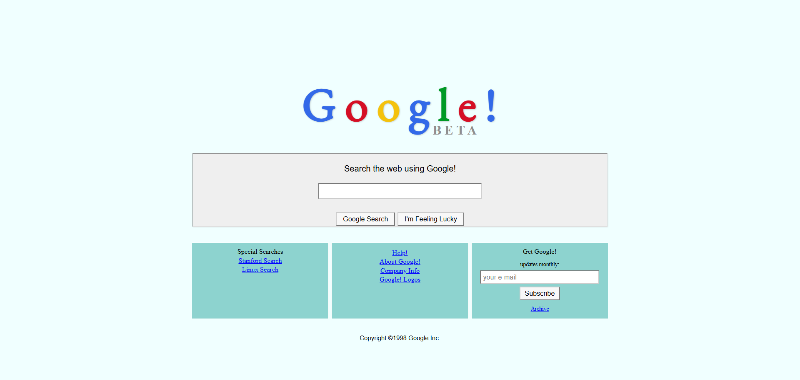

# Google 1998 Themed HTML Assignment

This project is a replica of the classic **Google 1998 homepage**, created as part of the **Kodluyoruz HTML Course**.

## 🧠 Purpose
The goal of this assignment is to practice basic HTML and CSS by recreating a nostalgic, iconic web page using modern web development practices — with an old-school look!

## 🧱 Technologies Used
- HTML5  
- CSS3  
- No JavaScript used — just pure front-end markup and styling.

## 🎨 Features
- Custom-styled retro **Google!** logo using spans and CSS
- Search form with “Google Search” and “I'm Feeling Lucky” buttons
- Classic footer layout with 3-column design
- 90s-style styling with `inset/outset` borders and vintage layout
- Fully responsive on modern browsers

## 📷 Preview

## 📁 How to Use
Simply open the `index.html` file in your browser. No build tools or server required.

---

> _This assignment was created as part of the Kodluyoruz HTML training._

